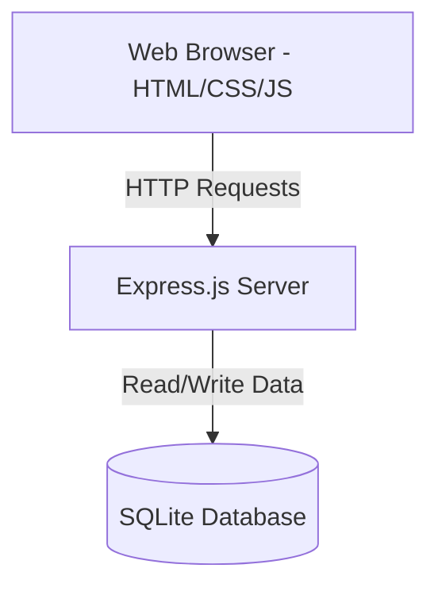

# Property Management Tracker

## Team Members
- Kulwinderjit (DHE25030064)
- [Team Member 2 Placeholder]
- [Team Member 3 Placeholder]

## Tech Stack
- **Frontend**: HTML, CSS, JavaScript (Vanilla)
- **Backend**: Node.js + Express.js
- **Database**: SQLite

## AI Tools Used
- Gemini (Google)

## System Architecture

The application follows a simple client-server architecture:

## Development Progress

### Day 1
- Initial project setup
- Created UI templates and static file structure
- Set up SQLite database schema

### Day 2
- Implemented user authentication logic
- Added SQLite login validation using parameterized queries
- Created Tenant Dashboard layout and functionality
- Created Admin Dashboard layout and functionality
- Added navigation between application screens
- Refined dashboard user interface

### Day 3
- Completed Maintenance Request module
- Implemented request details page to view individual requests
- Enhanced form validation and error handling (client and server-side)
- Refactored API routes into a separate Express router module
- Fixed minor UI and functional issues
- Ensured 100% parameterized SQLite queries for security
