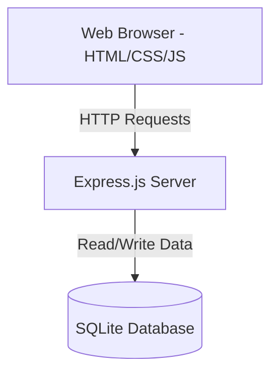

# Property Management Tracker

## Team Members
- Kulwinderjit (DHE25030064)
- [Team Member 2 Placeholder]
- [Team Member 3 Placeholder]

## Tech Stack
- **Frontend**: HTML, CSS, JavaScript (Vanilla)
- **Backend**: Node.js + Express.js
- **Database**: SQLite

## AI Tools Used
- Gemini (Google)

## System Architecture

The application follows a simple client-server architecture:

