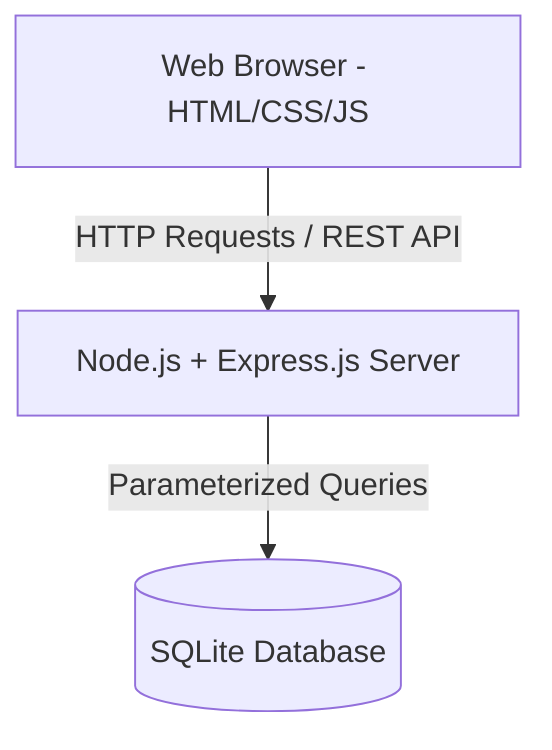

# Property Management Tracker

## Project Description
The Property Management Tracker is a web-based application designed to streamline maintenance requests between tenants and property administrators. Tenants can easily submit and track their maintenance requests, while administrators can manage and update the status of these requests from a centralized dashboard.

## Team Members
- Kulwinderjit (DHE25030064)
- [Team Member 2 Placeholder]
- [Team Member 3 Placeholder]

## Tech Stack
- **Frontend**: HTML5, CSS3, JavaScript (Vanilla)
- **Backend**: Node.js, Express.js
- **Database**: SQLite (with Parameterized Queries)

## Installation Steps
1. Clone the repository: `git clone <repo_url>`
2. Navigate to the project directory: `cd MIT107-Property-Management-Tracker`
3. Install dependencies: `npm install`
4. Start the application: `node app.js`
5. Open a web browser and go to `http://localhost:3000`

## Folder Structure
```text
/
├── app.js                 # Main application entry point
├── package.json           # Node.js dependencies
├── database/
│   ├── database.db        # SQLite database file
│   └── db.js              # Database connection and schema setup
├── public/
│   ├── css/               # Stylesheets
│   ├── js/                # Client-side JavaScript
│   └── images/            # Static images
├── routes/
│   └── requests.js        # Express routes for maintenance requests
└── views/                 # HTML templates
    ├── admin-dashboard.html
    ├── login.html
    ├── request-details.html
    └── tenant-dashboard.html
```

## AI Tools Used
- Gemini (Google): Used for code generation, debugging, refactoring, and generating documentation diagrams (Mermaid.js).

## System Architecture
The application follows a simple client-server architecture:



## Security Audit
- **SQL Injection Protection**: All database interactions use parameterized queries provided by the `sqlite3` library, preventing SQL injection vulnerabilities.
- **Input Validation**: Client-side and server-side validation is implemented to ensure data integrity (e.g., minimum length requirements for request titles and descriptions).
- **Authentication**: A basic role-based login system differentiates between 'tenant' and 'admin' roles, restricting access to appropriate dashboards and endpoints. (Note: For production, this should be upgraded to use hashed passwords and secure session management/JWT).
- **Authorization**: API endpoints verify user IDs to ensure tenants can only view their own requests, while admins have global access.

## Social Responsibility Statement
This Property Management Tracker aims to foster transparency, accountability, and prompt resolution of living condition issues between tenants and landlords. By providing an accessible and organized platform for maintenance tracking, we contribute to safer, healthier, and more equitable housing environments. We recognize the importance of data privacy and are committed to protecting user information within our system.

## Development Progress

### Day 1
- Initial project setup
- Created UI templates and static file structure
- Set up SQLite database schema

### Day 2
- Implemented user authentication logic
- Added SQLite login validation using parameterized queries
- Created Tenant Dashboard layout and functionality
- Created Admin Dashboard layout and functionality
- Added navigation between application screens
- Refined dashboard user interface

### Day 3
- Completed Maintenance Request module
- Implemented request details page to view individual requests
- Enhanced form validation and error handling (client and server-side)
- Refactored API routes into a separate Express router module
- Fixed minor UI and functional issues
### Day 4 (Final Day)
- Finalized authentication flow logic and redirect handling.
- Completed full CRUD functionality for the Maintenance Request module.
- Added ability for Tenants to Edit and Delete their 'Pending' requests.
- Added ability for Admins to Delete requests.
- Ensured 100% parameterized SQLite queries throughout all endpoints.
- Handled client and server-side validation and improved error message visibility.
