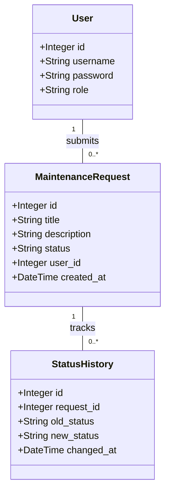

# UML Class Diagram



# Use Case Diagram

```mermaid
usecaseDiagram
    actor Tenant
    actor Admin

    package "Property Management System" {
        usecase "Login" as UC1
        usecase "Submit Maintenance Request" as UC2
        usecase "View Own Requests" as UC3
        usecase "View Request Details" as UC4
        usecase "View All Requests" as UC5
        usecase "Update Request Status" as UC6
        usecase "Logout" as UC7
    }

    Tenant --> UC1
    Tenant --> UC2
    Tenant --> UC3
    Tenant --> UC4
    Tenant --> UC7

    Admin --> UC1
    Admin --> UC4
    Admin --> UC5
    Admin --> UC6
    Admin --> UC7
```
