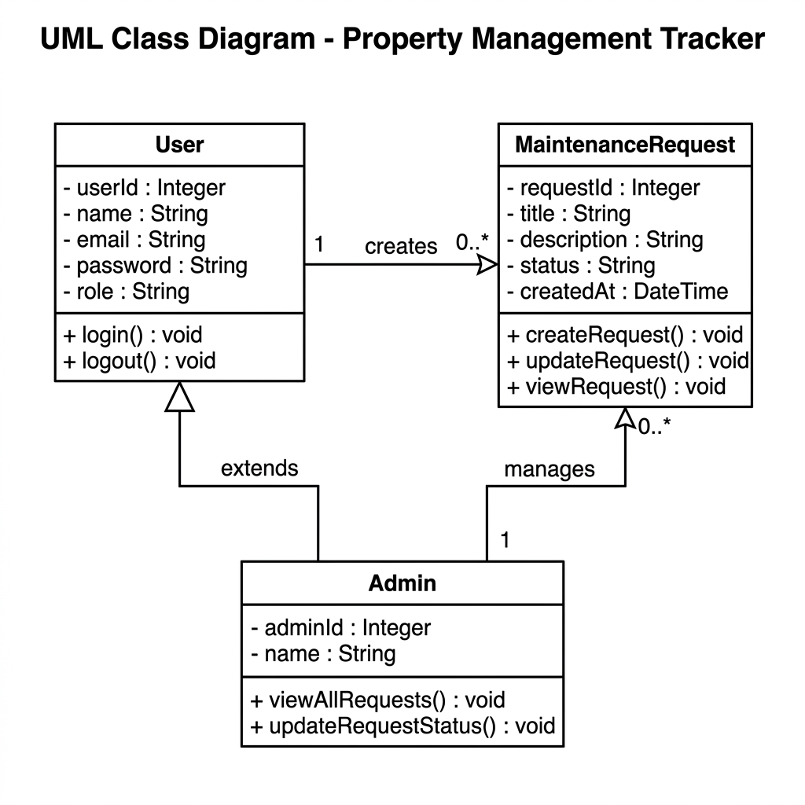

# UML Class Diagram

## Class Diagram - Property Management Tracker



### Class Descriptions

#### User
| Section    | Detail |
|------------|--------|
| Attributes | - userId : Integer |
|            | - name : String |
|            | - email : String |
|            | - password : String |
|            | - role : String |
| Methods    | + login() : void |
|            | + logout() : void |

#### Admin *(extends User)*
| Section    | Detail |
|------------|--------|
| Attributes | - adminId : Integer |
|            | - name : String |
| Methods    | + viewAllRequests() : void |
|            | + updateRequestStatus() : void |

#### MaintenanceRequest
| Section    | Detail |
|------------|--------|
| Attributes | - requestId : Integer |
|            | - title : String |
|            | - description : String |
|            | - status : String |
|            | - createdAt : DateTime |
| Methods    | + createRequest() : void |
|            | + updateRequest() : void |
|            | + viewRequest() : void |

### Relationships

| From  | To                 | Type        | Multiplicity | Label   |
|-------|--------------------|-------------|--------------|---------|
| User  | MaintenanceRequest | Association | 1 to 0..*   | creates |
| Admin | MaintenanceRequest | Association | 1 to 0..*   | manages |
| Admin | User               | Inheritance | —            | extends |

---

# Use Case Diagram

```
Actor: Tenant                          Actor: Admin
--------------                         ------------
     |                                      |
     |---> Login                            |---> Login
     |---> Submit Maintenance Request       |---> View All Requests
     |---> View Own Requests                |---> Update Request Status
     |---> View Request Details             |---> View Request Details
     |---> Logout                           |---> Logout
```
