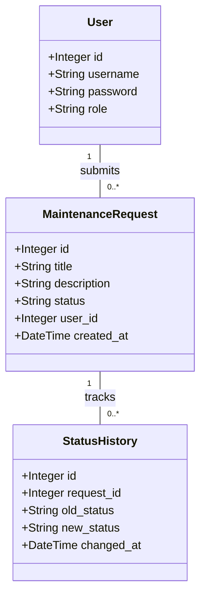

# UML Class Diagram

```mermaid
classDiagram
    class User {
        +Integer id
        +String username
        +String password
        +String role
    }

    class MaintenanceRequest {
        +Integer id
        +String title
        +String description
        +String status
        +Integer user_id
        +DateTime created_at
    }

    class StatusHistory {
        +Integer id
        +Integer request_id
        +String old_status
        +String new_status
        +DateTime changed_at
    }

    User "1" -- "0..*" MaintenanceRequest : submits
    MaintenanceRequest "1" -- "0..*" StatusHistory : tracks
```
